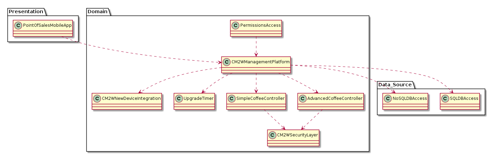

# ADD Iteration: 1

Date: 4/8/2020

## Step 1: Review Inputs

Lets begin by reviewing the inputs of our system and defining which requirements we will consider as drivers.
Design Purpose- The purpose of this design is to explore different prototypes to address the CM2W's desire to spread their IoT capabilities into the coffee industry.
Side Note: For ADD step 1, we can pretty much get all of our information straight from the M1 Initial Drivers Document

### Primary Functional Requirements
	UC1: User makes coffee on a small/medium/large machine
	UC2: Client checks how much coffee is left remotely
	UC3: Client orders more coffee supplies for multiple machines
	UC4: Supplier predicts when next coffee order will be needed
	UC5: Client describes business rules locking/unlocking users’ access to coffee machine
### Quality Attribute Scenarios
	QAS1: When a supplier upgrades a single-capsule coffee machine using the Simple Coffee Controller, the upgrade should take no more than 10 minutes.
	QAS2: When a supplier upgrades a commercial coffee machine using the Advanced Coffee Controller, the upgrade should take no more than two hours.
	QAS3: When a new device comes online, CM2W will automatically map it to the client’s account within two minutes.
	QAS4: If cell service goes down, then the controller software should log uses offline until cell services comes back up, then sync the updates all at once without information loss and without interrupting the coffee machine.
	QAS5: When a user dispenses coffee from a coffee machine during the morning rush, the coffee machine should push updates without any information loss and without interrupting the coffee machine itself.
### Constraints
	1. Controller software must be written in C.
	2. Simple Coffee Controller hardware cannot dispense coffee, but can do everything else the Advanced Coffee Controller can.
	3. Can't poll coffee machines for status. Need to wait for them to push status.
	4. All APIs must have no application state.
### Concerns
	Technology Concerns
		1. Two Point of Sale controllers being worked on: Simple Coffee Controller and Advanced Coffee Controller. Software needs to support both.
		2. Controllers connect to Internet over HSPDA. 
		3. Prefer to use a REST API over HTTPS. 
		4. Combine SQL and NoSQL databases in order to make our platform highly scalable. 
		5. Need on-premise Android 3.0 apps to automatically dispense coffee, plus iOS 7 + Android 3.0 app for checking stocks of all of client's machines. 
	Roles
		1. Suppliers, Clients, Users, and CM2W Admin 
		2. Only Clients can set business rules for controlling access and automatic re-ordering 
		3. Only Clients can manually request more inventory 
		4. Suppliers can only see stocks for machines that the Client specifies 
		5. Users only have permission to brew coffee at the machine by default, but can be given ability to see stocks for individual machines and ask a machine to make a coffee using an on-premise tablet app
		6. Only Clients can authorize CM2W Admins to access their data, either through the app or over the phone 
	Legal/data privacy issues
		1. Orders for more supplies need to be kept private so people don't raid the office supply when a new order comes in.
		2. Shouldn't be able to predict how much coffee is used just by looking for network traffic from the coffee machine. 
		
## Step 2: Establish Iteration Goal by Selecting Drivers

For the first step of ADD step 2, we need to consider the drivers for our system.
To identify our drivers, we need to analyze our quality attribute scenarios, conerns, roles, legal issues and constraints. Doing this will help us understand
the drivers of our system.
By referring to the M1 Initial Drivers Document, we can identify the following drivers:

### Performance
	1. QAS1
	2. QAS2
	3. QAS3
	4. Concerns - Technology Conern 3
### Availability
	1. QAS4
### Security
	1. QAS5
	2. Concerns - Roles 6
	3. Concerns - Roles 5
	4. Concerns - Legal/data privacy issues 1
	5. Concerns - Legal/data privacy issues 2
### Modifiability
	5. Concerns - Technology Concerns 4
	
## Step 3: Choose One or More Elements of the System to refine

Since this is greenfield development, we will be refining the entire CM2W coffee system

## Step 4: Choose One or More Design Concepts That Satisfy the Selected Drivers

Because this is our first iteration of the ADD process, our goal will be to establish an initial overall system structure. To do so, we will be considering
a couple reference architectures and deployements to satisfy our drivers.

### Design Decision: Logically structure our user based system using the Mobile Application Architecture

Rationale: The 5th technological concern mentions that our system "Needs on-premise Android 3.0 apps...., plus iOS 7 + Android 3.0 app for checking stocks
of all client's machines." That reason alone should be convincing enough for us to strongly consider the mobile application architecture, but there are
other drivers that we should consider as well. For instance, if the user wants to be able to check how much coffee they have left remotely, then we don't want
them to have to carry around their laptop all day with them. What if they work at a job where you aren't close to your laptop? Therefore, a mobile application
would be helpful in the sense that it will allow clients to remotely make coffee or check how much coffee is left (QAS1 + QAS2).
Additionally, according to external research, mobile applications make it very easy to use REST APIs rather than HTTPS (Technical concerns - 3). Finally,
using a mobile application will help addresses the ability for the client to authorize CM2W Admins to access their data over an APP (Concerns - Roles 5).

External Research: https://savvyapps.com/blog/how-to-build-restful-api-mobile-app

### Design Decision: Logically structure our user based system using the Rich Internet Application Architecture

Rationale: It should be pretty clear that our system will heavily rely on the internet for several operations like giving the client the ability to check
how much coffee is left remotely (UC2), allowing the client to order more coffee supplies (UC3), and automatically mapping new devices to the client's account
when it comes online within two minutes (QAS3). Also after doing some research, I realized that rich internet applications are especially helpful for mobile access,
integration among many system, and effective data visualition. These are absolutely critical for the CM2W coffee system, and which is why I am also considering
it as another reference architecture.

External Research: https://www.manufacturing.net/home/article/13055754/5-benefits-of-rich-internet-applications-for-manufacturing-roi

## Step 5: Instantiate Architectural Elements, Allocate Responsibility, and Define Interfaces

### Design Decision and Location: Add SQL and noSQL databases for the Mobile Application Architecture and the Rich Internet Application Architecture

Rationale: In order for our mobile application to be highly scalable and address our Modifiability driver for this iteration, we need to use SQL and noSQL
database platforms for our data source in the Mobile Application Reference Architecture and Rich Internet Application Architecture.

External Research: N/A

### Design Decision and Location: Add security layers to the Mobile and Rich Internet Application Architecture's that hide network traffic and office supplies

Rationale: This decision comes from our two concerns regarding privacy and legal concerns (Concerns - Legal/data privacy issues 1 and Concerns - Legal/data privacy issues 2)
Adding these security layers to our architecture will allow us to address these concerns; and now clients wont have the ability to immediately buy up all the
coffee ingrediants once they are shipped in. Additionally, users have their privacy ensured as their network traffic will not be monitored from a specific
coffee machine.

External Research: N/A

## Step 6: Sketch Views and Record Design Decisions

Deployement Pattern view of the system:

Responsibilities:

	1. PointOfSalesMobileApp - This will be the main UI of our system, and will display relavent data to the resepctive user of the application
	2. CM2WSecurityLayer - This hides all network traffic so as to protect user data privacy. Additionally, this will keep supply order information
	private so that people don't take all of the arriving supplies; per Legal/Privacy conerns 1 & 2
	3. CM2WManagementPlatform - This is going to be where the business logic of CM2W's coffee system will reside.
	4. SQLDBAccess - SQLDBAccess will grant our system access to a SQLDatabase; per Technology Conern 4
	5. NoSQLDBAccess - NoSQLDBAccess will grant our system access to a NoSQLDatabase; per Technology Conern 4
	6. UpgradeTimer - This will time the upgrades of our system and notify our CM2WManagementPlatform if an upgrade takes too long
	
## Step 7: Perform Analysis of Current Design and Review Iteration Goal and Achievement of Design Purpose

| Addressed| Partially Addressed | Not Addressed  | Decisions Made during Iteration |
| :---     | :---                |     :---:      |          ---: |
|  UC1     |                     |                |  Using the CM2W Management platform allows users to order their different sizes of coffee from different machines   |
|  UC2     |                     |                |   The mobile application reference architecture along with the rich internet application both allow the client to remotely check how much coffee is left    |
|  UC3     |                     |                |   The CM2W Management platform will allows clients to make orders for their different machines    |
|       |          UC4           |                |   I haven't yet though about how the supplier to going to function in the business logic of the system, however I already put a security layer in my module view to prevent supplies from being raided as soon as they arrive    |
|          |                     |         UC5    |   This will need to be incorporated in the business logic of the reference architecture I have provided, but it hasn't been explicitly provided yet    |
|  QAS1    |                     |                |   Added a timer into the module view of our system; this will make sure that upgrades using the Simple Coffee Controller are done within the 10 minute timeframe    |
|  QAS2    |                     |                |   Again, will be using the timer mentioned for QAS2 to make sure that the upgrade, this time using the Advanced Coffee Controller, will take less than 2 hours    |
|  QAS3    |                     |                |   We have logic specified our in the module view of our system so that new device logic is handled properly. We will use the timer again to ensure we meet our time constraint.    |
|  Tech-Concern 4    |                     |                |   Added SQL and NoSQL database access to the data source of the module view    |
|   Legal-Concern 1   |                     |                |   CM2WSecurityLayer will ensure that our system's order are hidden so that clients don't hoard orders up front    |
|   Legal-Concern 2   |                     |                |   Our system has both the SimpleCoffeeController and AdvancedCoffeeController tied to our security layer, which will prevent network traffic data from being broadcast or used to predict which station is most popular    |
|      |                     |         Constraint 1       |   Not yet addressed    |
|      |                     |         Constraint 2       |   Not yet addressed    |
|      |                     |         Constraint 3       |   Not yet addressed    |
|      |                     |         Constraint 4       |   Not yet addressed    |