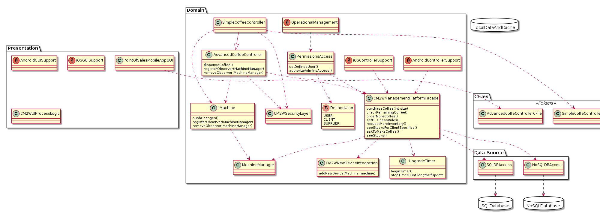

# ADD Iteration: 1

Date: 4/8/2020 - 4/11/2020

## Step 1: Review Inputs

Lets begin by reviewing the inputs of our system and defining which requirements we will consider as drivers.
Design Purpose- The purpose of this design is to explore different prototypes to address the CM2W's desire to spread their IoT capabilities into the coffee industry.

#### Side Note:

For ADD step 1, we can pretty much get all of our information straight from the M1 Initial Drivers Document

### Primary Functional Requirements
	UC1: User makes coffee on a small/medium/large machine
	UC2: Client checks how much coffee is left remotely
	UC3: Client orders more coffee supplies for multiple machines
	UC4: Supplier predicts when next coffee order will be needed
	UC5: Client describes business rules locking/unlocking users’ access to coffee machine
### Quality Attribute Scenarios
	QAS1: When a supplier upgrades a single-capsule coffee machine using the Simple Coffee Controller, the upgrade should take no more than 10 minutes.
	QAS2: When a supplier upgrades a commercial coffee machine using the Advanced Coffee Controller, the upgrade should take no more than two hours.
	QAS3: When a new device comes online, CM2W will automatically map it to the client’s account within two minutes.
	QAS4: If cell service goes down, then the controller software should log uses offline until cell services comes back up, then sync the updates all at once without information loss and without interrupting the coffee machine.
	QAS5: When a user dispenses coffee from a coffee machine during the morning rush, the coffee machine should push updates without any information loss and without interrupting the coffee machine itself.
### Constraints
	1. Controller software must be written in C.
	2. Simple Coffee Controller hardware cannot dispense coffee, but can do everything else the Advanced Coffee Controller can.
	3. Can't poll coffee machines for status. Need to wait for them to push status.
	4. All APIs must have no application state.
### Concerns
	Technology Concerns
		1. Two Point of Sale controllers being worked on: Simple Coffee Controller and Advanced Coffee Controller. Software needs to support both.
		2. Controllers connect to Internet over HSPDA. 
		3. Prefer to use a REST API over HTTPS. 
		4. Combine SQL and NoSQL databases in order to make our platform highly scalable. 
		5. Need on-premise Android 3.0 apps to automatically dispense coffee, plus iOS 7 + Android 3.0 app for checking stocks of all of client's machines. 
	Roles
		1. Suppliers, Clients, Users, and CM2W Admin 
		2. Only Clients can set business rules for controlling access and automatic re-ordering 
		3. Only Clients can manually request more inventory 
		4. Suppliers can only see stocks for machines that the Client specifies 
		5. Users only have permission to brew coffee at the machine by default, but can be given ability to see stocks for individual machines and ask a machine to make a coffee using an on-premise tablet app
		6. Only Clients can authorize CM2W Admins to access their data, either through the app or over the phone 
	Legal/data privacy issues
		1. Orders for more supplies need to be kept private so people don't raid the office supply when a new order comes in.
		2. Shouldn't be able to predict how much coffee is used just by looking for network traffic from the coffee machine. 
		
## Step 2: Establish Iteration Goal by Selecting Drivers

For the first step of ADD step 2, we need to consider the drivers for our system.
To identify our drivers, we need to analyze our quality attribute scenarios, conerns, roles, legal issues and constraints. Doing this will help us understand
the drivers of our system.
By referring to the M1 Initial Drivers Document, we can identify the following drivers:

### Performance
	1. QAS1
	2. QAS2
	3. QAS3
	4. Concerns - Technology Conern 3
### Availability
	1. QAS4
### Security
	1. QAS5
	2. Concerns - Roles 6
	3. Concerns - Roles 5
	4. Concerns - Legal/data privacy issues 1
	5. Concerns - Legal/data privacy issues 2
### Modifiability
	5. Concerns - Technology Concerns 4
	
## Step 3: Choose One or More Elements of the System to refine

Since this is greenfield development, we will be refining the entire CM2W coffee system

## Step 4: Choose One or More Design Concepts That Satisfy the Selected Drivers

Because this is our first iteration of the ADD process, our goal will be to establish an initial overall system structure. To do so, we will be considering
a couple reference architectures and deployements to satisfy our drivers.

### Design Decision: Logically structure our user based system using the Mobile Application Architecture

Rationale: The 5th technological concern mentions that our system "Needs on-premise Android 3.0 apps...., plus iOS 7 + Android 3.0 app for checking stocks
of all client's machines." That reason alone should be convincing enough for us to strongly consider the mobile application architecture, but there are
other drivers that we should consider as well. For instance, if the user wants to be able to check how much coffee they have left remotely, then we don't want
them to have to carry around their laptop all day with them. What if they work at a job where you aren't close to your laptop? Therefore, a mobile application
would be helpful in the sense that it will allow clients to remotely make coffee or check how much coffee is left (QAS1 + QAS2).
Additionally, according to external research, mobile applications make it very easy to use REST APIs rather than HTTPS (Technical concerns - 3). Finally,
using a mobile application will help addresses the ability for the client to authorize CM2W Admins to access their data over an APP (Concerns - Roles 5).

External Research: https://savvyapps.com/blog/how-to-build-restful-api-mobile-app

### Design Decision: Logically structure our user based system using the Rich Internet Application Architecture

Rationale: It should be pretty clear that our system will heavily rely on the internet for several operations like giving the client the ability to check
how much coffee is left remotely (UC2), allowing the client to order more coffee supplies (UC3), and automatically mapping new devices to the client's account
when it comes online within two minutes (QAS3). Also after doing some research, I realized that rich internet applications are especially helpful for mobile access,
integration among many system, and effective data visualition. These are absolutely critical for the CM2W coffee system, and which is why I am also considering
it as another reference architecture.

External Research: https://www.manufacturing.net/home/article/13055754/5-benefits-of-rich-internet-applications-for-manufacturing-roi

## Step 5: Instantiate Architectural Elements, Allocate Responsibility, and Define Interfaces

### Design Decision and Location: Add SQL and noSQL databases for the Mobile Application Architecture and the Rich Internet Application Architecture

Rationale: In order for our mobile application to be highly scalable and address our Modifiability driver for this iteration, we need to use SQL and noSQL
database platforms for our data source in the Mobile Application Reference Architecture and Rich Internet Application Architecture.

External Research: N/A

### Design Decision and Location: Add security layers to the Mobile and Rich Internet Application Architecture's that hide network traffic and office supplies

Rationale: This decision comes from our two concerns regarding privacy and legal concerns (Concerns - Legal/data privacy issues 1 and Concerns - Legal/data privacy issues 2)
Adding these security layers to our architecture will allow us to address these concerns; and now clients wont have the ability to immediately buy up all the
coffee ingrediants once they are shipped in. Additionally, users have their privacy ensured as their network traffic will not be monitored from a specific
coffee machine.

External Research: N/A

## Step 6: Sketch Views and Record Design Decisions

Initial Module view of the system (Module View):

Responsibilities:

	1. PointOfSalesMobileApp - This will be the main UI of our system, and will display relavent data to the resepctive user of the application
	2. CM2WSecurityLayer - This hides all network traffic so as to protect user data privacy. Additionally, this will keep supply order information
	private so that people don't take all of the arriving supplies; per Legal/Privacy conerns 1 & 2
	3. CM2WManagementPlatform - This is going to be where the business logic of CM2W's coffee system will reside.
	4. SQLDBAccess - SQLDBAccess will grant our system access to a SQLDatabase; per Technology Conern 4
	5. NoSQLDBAccess - NoSQLDBAccess will grant our system access to a NoSQLDatabase; per Technology Conern 4
	6. UpgradeTimer - This will time the upgrades of our system and notify our CM2WManagementPlatform if an upgrade takes too long
	7. PermissionsLayer - This essentially defines the users of our system and what level of access they will have to the CM2WManagementPlatform
	8. AdvancedCoffeeController - Logic for the client's ability to use and modify the AdvancedCoffeeController system
	9. SimpleCoffeeController - Logic for the client's ability to use and modify the SimpleCoffeeController system
	10. CM2WNewDeviceIntegration - Logic for adding new devices to the CM2WManagementPlatform
	11. Machine -- represents a coffee machine in our system
	
Going of this, we can instantiate our two reference architectures for this iteration

### Mobile Application Architecutre

### Rich Internet Application Architecture

	
### Tactics Considered

#### Performance
	1. Control resource demand: This was largely addressed with my system by quickly accounting for two databases. Doing this allows us to properly manage
	where the data of the system is going.

#### Security
	1. Resisting attacks: So this was a little hard to incorporate with the initial module view, but I ended up putting a security layer in the system in hopes
	that I would elaborate on it in future iterations to provide a layer against network attacks. Also, something internal, having a permissions layer is good
	general security that will help ensure the users of the system are doing only what they should be doing.
	
## Step 7: Perform Analysis of Current Design and Review Iteration Goal and Achievement of Design Purpose

| Addressed| Partially Addressed | Not Addressed  | Decisions Made during Iteration |
| :---     | :---                |     :---:      |          ---: |
|  UC1     |                     |                |  Using the CM2W Management platform allows users to order their different sizes of coffee from different machines   |
|  UC2     |                     |                |   The mobile application reference architecture along with the rich internet application both allow the client to remotely check how much coffee is left    |
|  UC3     |                     |                |   The CM2W Management platform will allows clients to make orders for their different machines    |
|       |          UC4           |                |   I haven't yet though about how the supplier to going to function in the business logic of the system, however I already put a security layer in my module view to prevent supplies from being raided as soon as they arrive    |
|          |                     |         UC5    |   This will need to be incorporated in the business logic of the reference architecture I have provided, but it hasn't been explicitly provided yet    |
|  QAS1    |                     |                |   Added a timer into the module view of our system; this will make sure that upgrades using the Simple Coffee Controller are done within the 10 minute timeframe    |
|  QAS2    |                     |                |   Again, will be using the timer mentioned for QAS2 to make sure that the upgrade, this time using the Advanced Coffee Controller, will take less than 2 hours    |
|  QAS3    |                     |                |   We have the CM2WNewDeviceIntegration in our system so that new device logic is handled properly. We will use the timer again to ensure we meet our time constraint.    |
|  Tech-Concern 1    |                     |                |   Both SimpleCoffeeController and AdvancedCoffeeController layers have been added to our system in order to support both systems    |
|      |                     |         Tech-Concern 2       |   Not yet addressed    |
|      |                     |         Tech-Concern 3       |   Not yet addressed    |
|  Tech-Concern 4    |                     |                |   Added SQL and NoSQL database access to the data source of the module view    |
|      |         Tech-Concern 5            |                |   PointOfSalesMobileApp is not specified by Android or iOS, but at least gives us a starting point to implement those specific versions    |
|  Roles-Concern 1    |                     |                |   PermissionsLayer will control different roles of the system and what user will have access to what features of the CM2WManagementPlatform   |
|      |                     |       Roles-Concern 2          |  Not yet addressed   |
|      |                     |       Roles-Concern 3          |  Not yet addressed   |
|      |                     |       Roles-Concern 4          |  Not yet addressed   |
|      |                     |       Roles-Concern 5          |  Not yet addressed   |
|      |                     |       Roles-Concern 6          |  Not yet addressed   |
|   Legal-Concern 1   |                     |                |   CM2WSecurityLayer will ensure that our system's order are hidden so that clients don't hoard orders up front    |
|   Legal-Concern 2   |                     |                |   Our system has both the SimpleCoffeeController and AdvancedCoffeeController tied to our security layer, which will prevent network traffic data from being broadcast or used to predict which station is most popular    |
|      |                     |         Constraint 1       |   Not yet addressed    |
|      |                     |         Constraint 2       |   Not yet addressed    |
|      |                     |         Constraint 3       |   Not yet addressed    |
|      |                     |         Constraint 4       |   Not yet addressed    |

# ADD Iteration: 2

Date: 4/11/2020 - 4/12/2020

## Step 1: Identifying Structures to Support Primary Functionality

I think it is important here to realize that I left a lot of the design vauge and open to interpretation from ADD Iteration 1. In this iteration, I will be
narrowing down on structures that I know will specifically address the concerns, constraints, and use cases that were not satisfied in my previous iteration
Our goal for this iteration is to begin thinking about what specific units we will use to implement our system. This will allow of to further divide the work
up into teams so that we have people working on specific areas of the system that they are trained for.

## Step 2: Establish Iteration Goal by Selecting Drivers

Again, we need to be looking at what needs to be done in order to support the primary functionality of our system. I think that it makes sense to address the
concerns of our system that were not satisfied in ADD iteration 1. The reason for this being they are critically important to the primary functionality of
the system. Therefore, in this iteration we will be looking to address the following drivers:

	
### Usability
	1. Technicial Concern 5
	2. Roles Concern 2
	3. Roles Concern 3
	4. Roles Concern 4
	5. Roles Concern 5
	6. Roles Concern 6
	
## Step 3: Choose One or More Elements of the System to Refine

In this iteration, we will be refining both the Module View of our system and translating it into respective designs for both our Mobile Application Architecture
and our Rich Internet Application. By first focusing on the Module View and then translating onto our specific architectures will allow us to kill two birds
with one stone in a sense; allowing us to solve problems and then narrow down our decision into our defined architectures. Once we have refined our Module
View, we can instantiate our architectures.

## Step 4: Choose one or More Design Concepts That Satisfy the Selected Drivers

### Design Decision: Convert the module view of our system into more of a domain model so that user objects and methods can be  defined

By adding specified user objects to our system, it will make our system much easier to handle different permissions and allow users to have functionality
that is different based on what the user is actually supposed to do. One benefit to this approach is that we already have our user PermissionsLayer specified,
now all we need to do is add our users. Additionally, since we are converting into a domain model, this will allow us to add some methods that are critical
for our system to function as needed. This will include some of the functions that we mentioned we needed to add in our first ADD iteration.

## Step 5: Instantitate Architetural Elements, Allocate Responsibilities, and Define Interfaces

| Design Decision & Location| Rationale |
| :---:                     |          :---: |
| Improve initial domain model with user objects | This will allow us to specifictly identify and address the issues presented to us, with regards to Role Concerns, in our drivers for this iteration |
| Introduce two new objects in the presentation layer - one for Android and iOS | Having two models that represent Android and iOS platforms allows us to also finish addressing Technical Concern 5, which was only partially addressed last iteration |
| Add methods to from ADD iteration 1 to domain Model | Adding methods allows us to more clearly define what the main business logic of our system will be doing |

## Step 6: Sketch Views and Record Design Decisions

Domain Model with useful methods: 

#### Important Side Note:

These methods are very abstract and open for change. I am really just trying to get a better idea for when I go to create Class Diagrams. I will not be
using these either of my reference architectures, it is simply there to get a general idea of where the functionality of the system will be distributed
and what classes will be responsible for what actions.

| Element | Responsibility |
| :---:  |          :---: |
|     DefinedUser    |        I made this an enum to signify that it was unchanging and that the only users of the system would be the User, the client and the supplier         |
|  Android/iOS Controller Support |     I was less sure on how to distinguish between the controllers for Android and iOS devices, so I just added that note. When the dev team goes to make the apps, they will know that both controllers will have to be different to adjust to the CM2WManagementPlatform      |
| Android/iOS GUI Support  |   Similarly, the GUI implementations are different for Android and iOS devices, so I put annotations in so the developers of the system know that        |
| OperationalManagement  |   This is here if CM2W every wants to change user permissions or define what users are able to do; this isn't spelled out by any driver but I thought it was good to include  |

## Tactics Considered

#### Usability
	1. Supporting system initiative. Have both Android and iOS GUI & controller support means that users can access the CM2WManagementPlatform on both Android devices and
	Apple devices
	

## Step 7: Perform Analysis of Current Design and Review Iteration Goal and Achievement of Design Purpose

#### Important Side Note: 

I defined all of the user classes (USER, CLIENT, SUPPLIER) in the actual class diagram. So when it comes to having users defined, that is what I did. That way I would not have
to list it in literally every table entry below. This means that users can access user-related functions through the PermissionsLayer's setDefinedUser() function, clients can access client-related functions
through the PermissionsLayer's setDefinedUser() function, etc. SetDefinedUser() will set the user and grant them functions mentioned in CM2WManagementPlatform.

| Addressed| Partially Addressed | Not Addressed  | Decisions Made during Iteration |
| :---     | :---                |     :---:      |          ---: |
|  Roles Concern 2        |                     |                |    In order for the clients to be able to set the business rules for controlling access, I've put in a function in the PermissionsLayer called setBusinessRules()                             |
|  Roles Concern 3        |                     |                |    Similarly, I put a function in the CM2WManagementPlatform called requestMoveInventory()                              |
|  Roles Concern 4        |                     |                |    There is now seeStocks() in the CM2WManagementPlatform                             |
|  Roles Concern 5        |                     |                |    I added a function called askToMakeCoffee() in the CM2WManagementPlatform, which applies to users                  |
|  Roles Concern 6        |                     |                |    There is another function called authorizeAdminsAccess(), but I put this one in PermissionsAccess instead of CM2WManagementPlatform                              |
|  Technical Concern 5        |                     |                |    Added Android and iOS annotations for both the domain layer and the presentation layer to handle both the Model and the Controller differences between Android and iOS apps                              |
|          |                     |        Constraint 1        |           Not addressed                       |
|          |                     |        Constraint 2        |           Not addressed                       |
|          |                     |        Constraint 3        |           Not addressed                       |
|          |                     |        Constraint 4        |           Not addressed                       |

# ADD Iteration: 3

Date: 4/12/2020

## Step 1: Refining previously created structures to fully address the remaining drivers

At this point in our design of this system, all that is left the address from a driver standpoint are the constraints. All the other drivers have been satisfied
through architectures, diagrams, or the module view produced by our system.

## Step 2: Establish Iteration Goal by Selecting Drivers

Our drivers for this iteration will be all the remaining ones that we haven't looked at yet. As previously mentioned, our constraints are the only
drivers remaining, so they will be the drivers looked at during this iteration.

### Modifiability
	1. Constraint 1
	2. Constraint 2
	3. Constraint 3
	4. Constraint 4
	
## Step 3: Choose One or More Elements of the System to Refine

If we are going to go off our previous diagrams, it is pretty clear that we will be doing most of the work in the domain layer of our system.

## Step 4: Choose one or More Design Concepts That Satisfy the Selected Drivers

The best approach here is to understand that our changes need to be made in the domain layer of our existing domain diagram. The changes are not big enough
to warrant huge design decisions. Instead, the best approach here is to understand that our problems can be solved so long as we properly modify our diagram
from the previous iteration.

## Step 5: Instantitate Architetural Elements, Allocate Responsibilities, and Define Interfaces

| Design Decision & Location| Rationale |
| :---:                     |          :---: |
|   Add c files in the data_source                   |      This will allow us to load in the C programs into the Java represented classes        |
|   Make SimpleCoffeeController a subclass of AdvancedCoffeeController                   |      This will allow us to put a dispenseCoffee function in AdvancedCoffeeController, signifying that the SimpleCoffeeController doesn't have it        |
|   Use the Observer pattern for Machines                   |      This will allow machines to push their status to the CM2WManagementPlatform and not have the CM2WManagementPlatform constantly polling for their status -- to do this I will be adding a seperate class to act as the subsriber of our system        |

## Step 6: Sketch Views and Record Design Decisions

## Tactics Considered:

#### Modifiability
	1. Increase Cohesion: I ensured that all the classes and methods that were added to our preliminary class diagram were in the right place and belonged where
	they did.
	2. Reduce Coupling: This is one area that will continue to need improvement more future consideration, as there is a fair amount of coupling within our system currently.

## Step 7: Perform Analysis of Current Design and Review Iteration Goal and Achievement of Design Purpose

At this point, we have satisfied all of our drivers and presented a different design for each iteration.