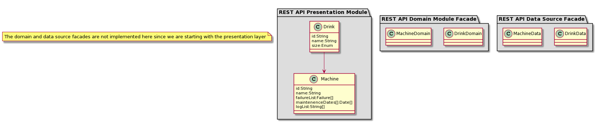

# ADD Iteration: 1

Date: 4/8/2020 - 4/11/2020

## Step 1: Review Inputs

Lets begin by reviewing the inputs of our system and defining which requirements we will consider as drivers.

Design Purpose- The purpose of this design is to explore different prototypes to address CM2W's desire to spread their IoT capabilities into the coffee industry.

#### Side Note:

For ADD step 1, we can pretty much get all of our information straight from the M1 Initial Drivers Document

### Primary Functional Requirements
	UC1: User makes coffee on a small/medium/large machine
	UC2: Client checks how much coffee is left remotely
	UC3: Client orders more coffee supplies for multiple machines
	UC4: Supplier predicts when next coffee order will be needed
	UC5: Client describes business rules locking/unlocking users’ access to coffee machine
### Quality Attribute Scenarios
	QAS1: When a supplier upgrades a single-capsule coffee machine using the Simple Coffee Controller, the upgrade should take no more than 10 minutes.
	QAS2: When a supplier upgrades a commercial coffee machine using the Advanced Coffee Controller, the upgrade should take no more than two hours.
	QAS3: When a new device comes online, CM2W will automatically map it to the client’s account within two minutes.
	QAS4: If cell service goes down, then the controller software should log uses offline until cell services comes back up, then sync the updates all at once without information loss and without interrupting the coffee machine.
	QAS5: When a user dispenses coffee from a coffee machine during the morning rush, the coffee machine should push updates without any information loss and without interrupting the coffee machine itself.
### Constraints
	1. Controller software must be written in C.
	2. Simple Coffee Controller hardware cannot dispense coffee, but can do everything else the Advanced Coffee Controller can.
	3. Can't poll coffee machines for status. Need to wait for them to push status.
	4. All APIs must have no application state.
### Concerns
	Technology Concerns
		1. Two Point of Sale controllers being worked on: Simple Coffee Controller and Advanced Coffee Controller. Software needs to support both.
		2. Controllers connect to Internet over HSPDA. 
		3. Prefer to use a REST API over HTTPS. 
		4. Combine SQL and NoSQL databases in order to make our platform highly scalable. 
		5. Need on-premise Android 3.0 apps to automatically dispense coffee, plus iOS 7 + Android 3.0 app for checking stocks of all of client's machines. 
	Roles
		1. Suppliers, Clients, Users, and CM2W Admin 
		2. Only Clients can set business rules for controlling access and automatic re-ordering 
		3. Only Clients can manually request more inventory 
		4. Suppliers can only see stocks for machines that the Client specifies 
		5. Users only have permission to brew coffee at the machine by default, but can be given ability to see stocks for individual machines and ask a machine to make a coffee using an on-premise tablet app
		6. Only Clients can authorize CM2W Admins to access their data, either through the app or over the phone 
	Legal/data privacy issues
		1. Orders for more supplies need to be kept private so people don't raid the office supply when a new order comes in.
		2. Shouldn't be able to predict how much coffee is used just by looking for network traffic from the coffee machine. 
		
## Step 2: Establish Iteration Goal by Selecting Drivers

For the first step of ADD step 2, we need to consider the drivers of our system.
To identify our drivers, we need to analyze our quality attribute scenarios, conerns, and constraints. Doing this will help us understand
the drivers of our system and what approaches can initially be taken to solve them.
By referring to the M1 Initial Drivers Document, we can identify the following drivers for our first iteration:

### Performance
	1. QAS1
	2. QAS2
	3. QAS3
	4. Concerns - Technology Conern 3
### Availability
	1. QAS4
### Security
	1. QAS5
	2. Concerns - Roles 6
	3. Concerns - Roles 5
	4. Concerns - Legal/data privacy issues 1
	5. Concerns - Legal/data privacy issues 2
### Modifiability
	5. Concerns - Technology Concerns 4
	
## Step 3: Choose One or More Elements of the System to refine

Since this is greenfield development, we will be refining the entire CM2W coffee system

## Step 4: Choose One or More Design Concepts That Satisfy the Selected Drivers

Because this is our first iteration of the ADD process, our goal will be to establish an initial overall system structure. To do so, we will be considering
our first reference architectures and a module view to satisfy our drivers.

### Design Decision: Logically structure our user based system using the Mobile Application Architecture

Rationale: The 5th technological concern mentions that our system "Needs on-premise Android 3.0 apps...., plus iOS 7 + Android 3.0 app for checking stocks
of all client's machines." That reason alone should be convincing enough for us to strongly consider the mobile application architecture, but there are
other drivers that we should consider as well. For instance, if the user wants to be able to check how much coffee they have left remotely, then we don't want
them to have to carry around their laptop all day with them. What if they work at a job where you aren't close to your laptop? Therefore, a mobile application
would be helpful in the sense that it will allow clients to remotely make coffee or check how much coffee is left (QAS1 + QAS2).
Additionally, according to external research, mobile applications make it very easy to use REST APIs rather than HTTPS (Technical concerns - 3). Finally,
using a mobile application will help addresses the ability for the client to authorize CM2W Admins to access their data over an app (Concerns - Roles 5).

External Research: https://savvyapps.com/blog/how-to-build-restful-api-mobile-app

## Step 5: Instantiate Architectural Elements, Allocate Responsibility, and Define Interfaces

### Design Decision and Location: Add SQL and noSQL databases for the Mobile Application Architecture

Rationale: In order for our mobile application to be highly scalable and address our Modifiability driver for this iteration, we need to use SQL and noSQL
database platforms for our data source in the Mobile Application Reference Architecture.

External Research: N/A

### Design Decision and Location: Add security layers to the Mobile Application Architecture's that hide network traffic and office supplies

Rationale: This decision comes from our two concerns regarding privacy and legal concerns (Concerns - Legal/data privacy issues 1 and Concerns - Legal/data privacy issues 2)
Adding these security layers to our architecture will allow us to address these concerns; and now clients wont have the ability to immediately buy up all the
coffee ingrediants once they are shipped in. Additionally, users have their privacy ensured as their network traffic will not be monitored from a specific
coffee machine.

External Research: N/A

## Step 6: Sketch Views and Record Design Decisions

Initial Module view of the system (Module View):

Going off of this, we will define our first reference architecture for this system.

### Mobile Application Architecutre

### Tactics Considered

#### Performance
	1. Control resource demand: This was largely addressed with my system by quickly accounting for two databases. Doing this allows us to properly manage
	where the data of the system is going. This will help reduce the traffic for database access.

#### Security
	1. Resisting attacks: So this was a little hard to incorporate with the initial module view, but I ended up putting a security layer in the system in hopes
	that I would elaborate on it in future iterations to provide a layer against network attacks. Also, something internal, having a permissions layer is good
	general security that will help ensure the users of the system are doing only what they should be doing.
	
## Step 7: Perform Analysis of Current Design and Review Iteration Goal and Achievement of Design Purpose

| Addressed| Partially Addressed | Not Addressed  | Decisions Made during Iteration |
| :---     | :---                |     :---:      |          ---: |
|  UC1     |                     |                |  Using the CM2W Management platform allows users to order their different sizes of coffee from different machines   |
|  UC2     |                     |                |   The mobile application reference architecture allow the client to remotely check how much coffee is left    |
|  UC3     |                     |                |   The CM2W Management platform will allows clients to make orders for their different machines    |
|  UC4     |                     |                |  I already put a security layer in my module view to prevent supplies from being raided as soon as they arrive    |
|          |                     |         UC5    |   This will need to be incorporated in the business logic of the reference architecture I have provided, but it hasn't been explicitly provided yet    |
|  QAS1    |                     |                |   Added a timer into the module view of our system; this will make sure that upgrades using the Simple Coffee Controller are done within the 10 minute timeframe    |
|  QAS2    |                     |                |   Again, will be using the timer mentioned for QAS2 to make sure that the upgrade, this time using the Advanced Coffee Controller, will take less than 2 hours    |
|  QAS3    |                     |                |   We have the CM2WNewDeviceIntegration class in our system so that new device logic is handled properly. We will use the timer again to ensure we meet our time constraint.    |
|  Tech-Concern 1    |                     |                |   Both SimpleCoffeeController and AdvancedCoffeeController classes have been added to our system in order to support both systems    |
|      |                     |         Tech-Concern 2       |   Not yet addressed    |
|      |                     |         Tech-Concern 3       |   Not yet addressed    |
|  Tech-Concern 4    |                     |                |   Added SQL and NoSQL database access to the data source of the module view    |
|      |         Tech-Concern 5            |                |   PointOfSalesMobileApp is not specified by Android or iOS, but at least gives us a starting point to implement those specific versions    |
|  Roles-Concern 1    |                     |                |   PermissionsLayer will control different roles of the system and what user will have access to what features of the CM2WManagementPlatform   |
|      |                     |       Roles-Concern 2          |  Not yet addressed   |
|      |                     |       Roles-Concern 3          |  Not yet addressed   |
|      |                     |       Roles-Concern 4          |  Not yet addressed   |
|      |                     |       Roles-Concern 5          |  Not yet addressed   |
|      |                     |       Roles-Concern 6          |  Not yet addressed   |
|   Legal-Concern 1   |                     |                |   CM2WSecurityLayer will ensure that our system's order are hidden so that clients don't hoard orders up front    |
|   Legal-Concern 2   |                     |                |   Our system has both the SimpleCoffeeController and AdvancedCoffeeController tied to our security layer, which will prevent network traffic data from being broadcast or used to predict which station is most popular    |
|      |                     |         Constraint 1       |   Not yet addressed    |
|      |                     |         Constraint 2       |   Not yet addressed    |
|      |                     |         Constraint 3       |   Not yet addressed    |
|      |                     |         Constraint 4       |   Not yet addressed    |

# ADD Iteration: 2

Date: 4/11/2020 - 4/12/2020

## Step 1: Identifying Structures to Support Primary Functionality

I think it is important here to realize that I left a lot of the design  open to interpretation from ADD Iteration 1. In this iteration, I will be
narrowing down on structures that I know will specifically address the concerns, constraints, and use cases that were not satisfied in my previous iteration.
Our goal for this iteration is to begin thinking about what specific units we will use to implement our system. This will allow us to further divide the work
up into teams so that we have people working on specific areas of the system that they are trained for when development begins. I will additionally do another reference architecture
for consideration in this milestone. Finally, I should note that a lot of addressed drivers in the previous milestone need methods to specifically address the
driver. Therefore, those methods will be added in this iteration.

## Step 2: Establish Iteration Goal by Selecting Drivers

Again, we need to be looking at what needs to be done in order to support the primary functionality of our system. I think that it makes sense to address the
concerns of our system that were not satisfied in ADD iteration 1. The reason for this being they are critically important to the primary functionality of
the system. Therefore, in this iteration we will be looking to address the following drivers:

	
### Usability
	1. Technicial Concern 5
	2. Roles Concern 2
	3. Roles Concern 3
	4. Roles Concern 4
	5. Roles Concern 5
	6. Roles Concern 6
	
## Step 3: Choose One or More Elements of the System to Refine

In this iteration, we will be considering another reference architecture . I will go into detail on that in the next step, but I also want to add methods to
our domain model so it looks more like a Class Diagram. This will give us a better understand of the functionality of each part in our system. I will first consider
another architecture, and then move on to creating a Class Diagram from our Domain Model.

## Step 4: Choose one or More Design Concepts That Satisfy the Selected Drivers

### Design Decision: Logically structure our user based system using the Rich Internet Application Architecture

Rationale: It should be pretty clear that our system will heavily rely on the internet for several operations like giving the client the ability to check
how much coffee is left remotely (UC2), allowing the client to order more coffee supplies (UC3), and automatically mapping new devices to the client's account
when it comes online within two minutes (QAS3). Also after doing some research and going further into the project, I realized that rich internet applications are especially helpful for mobile access,
integration among many systems, and effective data visualition. These are absolutely critical for the CM2W coffee system, and which is why I am also considering
it as another reference architecture.

External Research: https://www.manufacturing.net/home/article/13055754/5-benefits-of-rich-internet-applications-for-manufacturing-roi

### Design Decision: Convert the module view of our system into more of a domain model so that user objects and methods can be  defined

By adding specified user objects and methods to our system, it will make our system much easier to handle different permissions and allow users to have functionality
that is different based on what the user is actually supposed to do. One benefit to this approach is that we already have our user PermissionsLayer specified,
now all we need to do is add our users. Additionally, since we are converting into a class diagram, this will allow us to add some methods that are critical
for our system to function as needed. This will include some of the functions that we mentioned we needed to add in our first ADD iteration.

## Step 5: Instantitate Architetural Elements, Allocate Responsibilities, and Define Interfaces

| Design Decision & Location| Rationale |
| :---:                     |          :---: |
| Improve initial domain model with user objects | This will allow us to specifictly identify and address the issues presented to us, with regards to Role Concerns, in our drivers for this iteration |
| Introduce two new objects in the presentation layer - one for Android and iOS | Having two models that represent Android and iOS platforms allows us to also finish addressing Technical Concern 5, which was only partially addressed last iteration |
| Add methods to from ADD iteration 1 to domain Model | Adding methods allows us to more clearly define what the main business logic of our system will be doing |

## Step 6: Sketch Views and Record Design Decisions

### Rich Internet Application Architecture

After developing the architecture for the rich internet application, I have decided more of the system should be designed for a mobile application, and so from
here on our, I will base my architectures on that. I am simply doing this because there is not a lot of fundamental architectural different between the two,
and mobile applications also seem to satisfy more drivers that rich internet applications. Additionally, I just believe it makes overall sense to use a mobile
app rather than a Rich Internet Application. Ordering coffee is something that companies like Starbucks use mobiles apps for, and was the best selling Apple
app until recently. More people are using apps to order coffee that their computers or phone browsers, so we're gonna stick with that to have a larger
customer base and address more drivers.

External Research: https://www.emarketer.com/content/apple-pay-overtakes-starbucks-as-top-mobile-payment-app-in-the-us

Class Diagram: 

#### Important Side Note:

These methods are open for change. I am really just trying to get a better idea for when I go to create finalize the Class Diagram. These methods
are simply here to get a general idea of where the functionality of the system will be distributed
and what classes will be responsible for what actions.

| Element | Responsibility |
| :---:  |          :---: |
|     DefinedUser    |        I made this an enum to signify that it was unchanging and that the only users of the system would be the User, the client and the supplier         |
|  Android/iOS Controller Support |     I was less sure on how to distinguish between the controllers for Android and iOS devices, so I just added that note. When the dev team goes to make the apps, they will know that both controllers will have to be different to adjust to the CM2WManagementPlatform      |
| Android/iOS GUI Support  |   Similarly, the GUI implementations are different for Android and iOS devices, so I put annotations in so the developers of the system know that        |
| OperationalManagement  |   This is here if CM2W every wants to change user permissions or define what users are able to do; this isn't spelled out by any driver but I thought it was good to include  |

## Tactics Considered

#### Usability
	1. Supporting system initiative. Have both Android and iOS GUI & controller support means that users can access the CM2WManagementPlatform on both Android devices and
	Apple devices
	

## Step 7: Perform Analysis of Current Design and Review Iteration Goal and Achievement of Design Purpose

#### Important Side Note: 

I defined all of the user classes (USER, CLIENT, SUPPLIER) in the actual class diagram. So when it comes to having users defined, that is what I did. That way I would not have
to list it in literally every table entry below. This means that users can access user-related functions through the PermissionsLayer's setDefinedUser() function, clients can access client-related functions
through the PermissionsLayer's setDefinedUser() function, etc. SetDefinedUser() will set the user and grant them functions mentioned in CM2WManagementPlatform.

| Addressed| Partially Addressed | Not Addressed  | Decisions Made during Iteration |
| :---     | :---                |     :---:      |          ---: |
|  Roles Concern 2 & UC5        |                     |                |    In order for the clients to be able to set the business rules for controlling access, I've put in a function in the PermissionsLayer called setBusinessRules()                             |
|  Roles Concern 3        |                     |                |    Similarly, I put a function in the CM2WManagementPlatform called requestMoveInventory()                              |
|  Roles Concern 4        |                     |                |    There is now seeStocks() in the CM2WManagementPlatform                             |
|  Roles Concern 5        |                     |                |    I added a function called askToMakeCoffee() in the CM2WManagementPlatform, which applies to users                  |
|  Roles Concern 6        |                     |                |    There is another function called authorizeAdminsAccess(), but I put this one in PermissionsAccess instead of CM2WManagementPlatform because it pertains to granting permissions to users                              |
|  Technical Concern 5        |                     |                |    Added Android and iOS annotations for both the domain layer and the presentation layer to handle both the Model and the Controller differences between Android and iOS apps                              |
|          |                     |        Constraint 1        |           Not addressed                       |
|          |                     |        Constraint 2        |           Not addressed                       |
|          |                     |        Constraint 3        |           Not addressed                       |
|          |                     |        Constraint 4        |           Not addressed                       |

# ADD Iteration: 3

Date: 4/12/2020

## Step 1: Refining previously created structures to fully address the remaining drivers

At this point in our design of this system, all that is left to address from a driver standpoint are the constraints. All the other drivers have been satisfied
through architectures, diagrams, or the class diagram produced in the previous two iterations.

## Step 2: Establish Iteration Goal by Selecting Drivers

Our drivers for this iteration will be all the remaining ones that we haven't looked at yet. As previously mentioned, our constraints are the only
drivers remaining, so they will be the drivers looked at during this iteration.

### Modifiability
	1. Constraint 1
	2. Constraint 2
	3. Constraint 3
	4. Constraint 4
	
## Step 3: Choose One or More Elements of the System to Refine

If we are going to go off our previous diagrams, it is pretty clear that we will be doing most of the work in the domain layer of our system.

## Step 4: Choose one or More Design Concepts That Satisfy the Selected Drivers

The best approach here is to understand that our changes need to be made in the domain layer of our existing domain diagram. The changes are not big enough
to warrant huge design decisions. Instead, the best approach here is to understand that our problems can be solved so long as we properly modify our diagram
from the previous iteration.

## Step 5: Instantitate Architetural Elements, Allocate Responsibilities, and Define Interfaces

| Design Decision & Location| Rationale |
| :---:                     |          :---: |
|   Add c files in the data_source                   |      This will allow us to load in the C programs into the Java represented classes        |
|   Make SimpleCoffeeController a subclass of AdvancedCoffeeController                   |      This will allow us to put a dispenseCoffee function in AdvancedCoffeeController, signifying that the SimpleCoffeeController doesn't have it        |
|   Use the Observer pattern for Machines                   |      This will allow machines to push their status to the CM2WManagementPlatform and not have the CM2WManagementPlatform constantly polling for their status -- to do this I will be adding a seperate class to act as the subsriber of our system        |
|    In order for our system to have no application state, we will be storing application state data in the local cache seen to the right of the Domain layer                        |        We are doing this so we don't have any application state          |

## Step 6: Sketch Views and Record Design Decisions

## Tactics Considered:

#### Modifiability
	1. Increase Cohesion: I ensured that all the classes and methods that were added to our preliminary class diagram were in the right place and belonged where
	they did.
	2. Reduce Coupling: This is one area that will continue to need improvement more future consideration, as there is a fair amount of coupling within our system currently.

## Step 7: Perform Analysis of Current Design and Review Iteration Goal and Achievement of Design Purpose

At this point, we have satisfied all of our drivers.

# Project Milestone 2

## Assessing Completeness

Time Spent: 3.5 hours -- spread over 2 days

### 1. Which Use Cases did the notebook's designs address? In short: how did it address them?

Design 1: This document addressed all of the use cases;  except for use case 2 and use case 5. Specifically, it attempted to address all the use cases at once by addressing the primary functionality in one iteration.
The author ended up modifying both of their reference architectures, and by also instantiating a sequence diagram to go over the workflow
of a user purchasing coffee, displaying what elements of the system would be respoonsible for what actions regarding the use cases. Additionally, a domain model was instantiated in order
to display what nouns would be involved in solving the primary functionality, including the use cases, of the system.This was able to handle UC1, UC3, and UC4. However,
UC2 and UC5 still remained unaddressed.

Design 2: The notebook here addressed all of the use cases for the system. It did so by first selecting a service application in the first iteration and instantiating several elements
which were responsbile for achieving the use cases in the second iteration. The Client Element identified in iteration 2 could access the coffee machines and remotely check how
much coffee is left (UC2). The Client element also can make manual requests for more inventory from the supplier regarding different machines (UC3)
Additionally, the User element allows for users to be able to make coffee on machines (UC1).
The Supplier Service element is responsible
for taking requests from the supplier (UC4). The Client element also specifically mentions how it allows Admins to access data over the phone or through the
app, depending on the rules specified by the client. Finally, the author included another section regarding the clients setting business rules (UC5).

### 2. Which Use Cases remain unaddressed by this notebook?

Design 1: UC2 & UC5 both remain unaddressed. I think this could have been avoided if the author tried to address each use case individually rather than just
all of the primary functionality in one iteration. In this case, it lead to use cases being left out and the system not addressing all of the initial drivers
laid out by M1.

Design 2: Although all of the use cases were properly addressed, I do have a couple comments. The author needs to fully spell out the first use case, and make
sure that the users can select different sizes of coffee (small, medium, large). This use case was addressed, but could have been clarified. Also, I think it might be
wise for the author to consolidate "Management Apps" and "Client App", since both involve the CM2W Administrator monitoring access to machines and usages.

### 3. Which Quality Attribute Scenarios did the notebook's designs address? In short: how did it address them?

Design 1: This design was able to explicity address each QAS for our initial drivers. It did so by devouting an entire interation (ADD Iteration 2, the second one -- there were 2 ADD Iteations 2s)
to the Quality Attribute scenarios. It then went on to add more conceptual classes to the domain diagram to address those issues, along with sketching a system
sequence diagram to describe how different parts of the system would react to the morning rush for coffee.

Design 2: This design addressed every QAS, except for QAS4. The author of the notebook utilized some cool patterns for the other quality attribute scenarios. For instance,
QAS1,2 and 3 were all addressed by using the Load-Balanced Cluters deplayement pattern. This pattern is utilized for it's scalability and performance. This pattern will
also utilize the many severs that were put in the architectural design. Additionally, using controllers that connect to the internet over HSDPA addressed QAS5
by "increasing data capacity and speed up transfer rates", which helps dispense coffee during the morning rush.

### 4. Which Quality Attribute Scenarios remain unaddressed by this notebook? 

Design 1: There are no quality attribute scenarios that were unaddressed in the noetbook. It was very helpful that the author of this notebook explicity labeled
the quality attribute scenarios, as it made it very easy to find and confirm. It would have been nice if the author did the same thing with the use cases.

Design 2: All quality attribute scenarios here were addressed. This was done by explicity listing the quality attribute and what design decisions would be taken
in order to address them, during ADD iteration 1.

### 5. What known Tactics from the back of our book did the notebook use to address the Quality Attribute Scenarios?

Design 1: The author did use tactics to address QAS1, QAS3*, and QAS5; although they didn't explicity name them. For QAS1, the author suggested to create
requirements for the system. For QAS3, the author suggested to store new device information in the management layer (*not sure if this is a tactic). For QAS5, the
author suggested the machine take a multi-processing state by sending information to the management platform.

Design 2: No tactics were used to address the Quality Attribute Scenarios in this design.

### 6. Did the notebook pull from external research? What did that research really add to the design? 

Design 1: Yes. There was a lot of external research from many different sources. This primarily helped with the domain models and addressing the architectural
constraints of the system. As a result, the domain models of the system were very sophisticated and well developed. Additionally, the author did a goob job
of addressing the architectual concerns of the system, and was able to identify some key considerations by using REST APIs over HTTPS. As a result of identifying
those key considerations, the author picked their reference architecture with even more supporting informatiom.

Design 2: Yes. The research provided by the external sources helped reinforce many of the design decisions that were made early on. This greatly helped the design
by backing up the decisions he made with these external sources. For instance, the load balancing algorithm that was used to address the time concerns listed in the
use cases was reinforced by research that indicated that it would be used to "make sure that requests are being processed in the quickest time possible." There are 10
external sources used throughout the document for even more supporting information.

### 7. Did the notebook compare the pros/cons of possible ideas? 

Design 1: Yes. Although not explicity stated, the author discussed both the pros and cons of each system in Step 7 of the ADD iteration1 (Analysis of current Design).
However, there could hvae been more discussion after iteration 1; as it seemed to stop after that.

Design 2: Although there was not a list-style comparison of the pros & cons of the system, the author certainly analyzed the pros and cons in the rationale
when deciding the better of two candidate designs.

### 8. Was it convenient for you to find the above information? 

Design 1: No. Although the notebook was organized into the 3 ADD iterations that were taken, along with all of the ADD steps, finding the information above
took a long time and was not convenient to find. The reason for this is simple; the author hardly ever explicity stated what he was addressing during each iteration.
Instead, the author took a general approach to the drivers and did not mention them specifically. As a result, the drivers were very hard to locate and even harder to understand
where they were being addressed.

Design 2: Yes. The notebook was well organized and neatly laid out.

## Sunny Day Test

Time Spent: 3 hours -- spread over 2 days

### 1. Write down the steps that you imagine the user/client will follow to achieve these goals.
	
Design 1: First, the user would need to open the application on their phone, and select the size and type of coffee that they wish to order.
For the client, the process would be similar. They would first need to launch the application on their phone. They would then be able to select the coffee machine of
interest and have access to inventory status of that particular machine.

Design 2: The user and client will first need to sign in to the mobile application so they are granted their respective access levels. From there, the user will
be able to select the size and type of coffee that they want from the machine of their choice. For the client, they also need to only open the mobile
application to check and see how much coffee is left as well.

### 2. What do you suppose are the Preconditions?

Design 1: First of all, both the client and the user need to have access to their phones and the CM2W application on their phones. There also needs to be cell reception
such that the coffee machine will be able to wirelessly communicate it's data back to the client and user. The user will not have access to the inventory data of the coffee machine, but the
user will be able to order coffee on a machine they have access to provided that the coffee machine has the ingredients and power necessary the user's desired coffee.
Since the design document did not mention time constraints, this could hypothetically occur at any point during the day; so long as the other preconditions I mentioned were
satisfied.

Design 2: I believe the preconditions here are that both the client and the user must have access to the CM2W mobile application on their phone, and be in a location
with acceptable cell reception. They also need to be able to successfully sign in to the application to have their respective priveleges. Additionally, the coffee machine that the user wants to make coffee from must have sufficient ingredients and power to actually make the coffee
of the user's choosing. This could happen at any time during the day; so as long as the preconditions above are satisfied, the workflow of the user ordering coffee should be able to be satisfied at any time.

### 3. What do you suppose the Postconditions are?

Design 1: I think that the postconditions here would be that the user has received their ordered cup of coffee and that inventory information has updated the system such that the
client could check how much coffee was left at that station on the mobile app if they wanted to.

Design 2: I believe the postconditions here would be that the user has ordered and recieved their coffee, and that information has beensent to the database for 
the client to check and see how much coffee is left at that station. (very similar to design 1)

## Testing Each Design

Time Spent: 1.5 hours

### Sequence Diagrams

Design 1: 

Design 2:

### Additional Preconditions

Design 1: The precondition here is that the client and the user have successfully signed into the application.

Design 2: There are no additional preconditions brought in by this design in order to function.

### Postconditons

Design 1: The postconditions were successfully satisfied by this design.

Design 2: The postconditions were successfully satisfied by this design.

## Rainy Day Test

Time spent: 1 hour

Design 1: Say that CM2W had a large update which would entail many user interface changes along with some business logic changes regarding the machines connected
in the system. This update will take at least an hour and a half, but could take longer if the signal to the internet is strained or under heavy traffic. This notebook
suggestst that controllers will need to check for updates less frequently. However when it does update, it will need to complete the update in less than 2 hours.
However, this design does not employ any tactics to address how to actually go about downloading the update in less than 2 hours. If the system started to download the update at the
wrong time, say during another traffic heavy software update, the system would not be able download the update in less than 2 hours. This is because the system does not
identify any tactics to address this aside from infrequently checking for updates. There is no actual plan for if this check occurs at the wrong time. Therefore, the system is at risk of not satisfying QAS2.

Design 2: The notebook mentions that in the case where the system went offline, data would be logged, using C, to some offline controller memory storage.
Lets imagine that we have been using the CM2W system for a while, and the offline memory of the system is nearing its peak. Unfortunately, while the memory nears its peak
the system also goes offline. Although we can try to log additional information to memory, we would lose some data because we don't have any plan for when 
memory is full. Hence, our system does not have any backups for offline memory when the servers goes down. This puts the system at risk of not completely satisfying
QAS4.

## Conclusion

Time spent: 30 mins

### Which of the two notebooks has the better design?

I would say that the second notebook is better. It offers more specifics on how it would actually go about addressing the drivers. Instead of generally addressing
the primary funcionality, it explicity has sections that describe how each driver will be addressed, by name. Additionally, it provides element description tables and uses domain specific
naming in all of the domain models and sequence diagrams provided, unlike design 1. Finally, it provides more description on what the actual elements in the system's
domain model are doing, along with more research to support design decision and instiation of elements.

## Reflection

Time spent: 1 hour

### Was there anything missing from either of these notebooks that would have made your evaluation easier?

Design 1: Explicity state the drivers that they are addressing. This was especially true because not having the drivers named out often meant it took a lot
of time to find out where specific drivers were being discussed.

Design 2: Use larger titles. Although the notebook was generally laid out well and easy to navigate through, having larger titles to denote ADD iterations
and different steps within those iterations would have made the notebook more understandable. Also, spell out what use cases are being used. This would have made
the system much easier to understand.

### 2. Now that you've done this exercise: was there anything that you wish *you* had in your notebook, but did not?

I wish I would have used a sequence diagram instead of doing class diagrams. Class diagrams are too specific and aren't helpful in an architectural sense. I also
wish I would have provided more specifics on how my designs could have handled rainy day scenarios. My design was certainly prone to errors; errors
that could have been addressed had I done a better job explaining how my system could handle faults. Additionally, I think it would have been useful to include
a few more topics to support design decisions; they could have made my design more sound and overall handle situations better. Finally, I wish I had provided more
discussion on the pros and cons of my design decisions. I always gave supporting evidence for my design decisions, but I never discussed possible flaws; which would
have been useful in the analysis for possible rainy day scenarios and adjusting properly to them.

# Project Milestone 3

## Date: 5/20/2020

Sidenote: Github acted weird recently and some of the changes that I made did not get pushed up until 5/24/2020. However, I began the project on 5/20/2020, although it may
seem as it was all done over the weekend.

# ADD Iteration 1 - Presentation

Time spent: 3 hours

## Step 1: Review Inputs

First, it is important to understand that one of the initial drivers regarding the APIs that will be used in the system is that they must have **no application state**.
This essentially means that the **CM2W system** will not hold concrete data regarding the system. Actually having application state is typically done via what is known as HTTPApplication state,
which is when a site uses nouns and other objects to represent the state of the system at any given time. Our system must **not** support this feature. Instead, we
will be using our REST APIs to store system information. While going through the iteration of ADD for Presentation, we will consider this and make decisions that
will allow our system to have no application state, and rather store data in REST APIs instead.

Additionally, we have new modifiability drivers laid out in the document. These are the new inputs we must consider along with the previous sequence diagrams
and domain models that have been constructed in previous iterations.

## Step 2: Establish Iteration Goal by Selecting Drivers

We have new **modifiability quality attribute scenarios** that we will be considering during this iteration goal. The requirements document had a good line that
summarized the following modifiability requirements: **The system must support additional features as the coffee machines become more sophisticated.**
Specifically, the following features must be considered

### Modifiability
	1. QAS1: The system must be able to indicate system failures and schedule routine maintenance.
	2. QAS2: The system must include the ability to remotely configure the machine to produce coffee in different modes; such as economy and premium modes.
	3. QAS3: The system should support other automated drink machines that are being developed, such as juicers, shake/malt, and smoothie/lassi machines that will support similar interfaces.
	
## Step 3: Choose One or More Elements of the System to Refine

Because we will be modifying the **presentation layer** of our system, we will be make a sequence diagram and refine the presentation layer of our mobile
application architecture. This will not only give us a better idea of how the CM2W system will be interacting with external actors, it will be us a better understanding
of what new modules will be introduced on the architectural level in order to meet our system's requirements.

Finally, I will be taking a deeper look into our REST API, and design a preliminary domain model for that. This is because our application must not have application
state, and we must hold data in the REST API. In order to effectively do so, I will design our REST API to hold onto data that will be important for the CM2W
system to properly function. However, since this is the iteration for the presentation layer of our system, I will only be constructing REST API objects that
deal with the system's presentation modules.

## Step 4: Choose One or More Design Concepts that Satisfy the Selected Drivers

As mentioned in step 3, several modules of the system will be refined via several concepts, listed below.

### Design Decision: Construct a REST API Domain Model and Only Considering Presentation Aspects

Rationale: In order for the system to have no application state, our REST API must be in charge of holding relevant data regarding our system. I will begin
constructing a REST API to do so, but only consider the presentation aspects that are important for storage; since this is the presentation ADD iteration. In future
iterations, I anticipate that the REST API will have many more features and be given further responsibility, because we will need to consider it's role regarding
data source and domain interactions. For now, I will simply use a facade to represent those two entities.

External Research: http://blog.peterritchie.com/Mapping+a+Domain+Model+To+RESTful/

### Design Decision: Design a Sequence Diagram to Address the Modifiability Quality Attribute Scenarios

Rationale: Sequence diagrams gives us an understanding of how our system will be interacting with external actors. Introducing our REST API will certainly involve changes
in the presentation layer, since that is where the user will be interacting with the system. Since I am also refining the REST API this module, it is cruical for the Sequence Diagram to adapt the changes made there.

External Research: N/A

### Design Decision: Refine the Mobile Application Architecture's Presentation Layer to Accurately Address RestAPI through the Adapter Pattern

Rationale: Although this may seem superfluous, I believe it is critical to begin to anticipate where our **architecture** might actually change as a result of
sequence diagram changes and API changes. Anticipating some of the changes will help us down the road when we adjust our overall architectures to meet the presentation
needs of our drivers.

External Research: https://www.appvelocity.ca/blog/guide-mobile-application-architecture

## Step 5: Instantiate Architectural Elements, Allocate Responsibilities and Define Interfaces

| Design Decision & Location| Rationale |
| :---:                     |          :---: |
| Construct a Preliminary Sketch of our REST API | Again, we want to store our objects of the system to allow for no application state, constructing an initial model of the REST API will help us understand its responsibilities|
| Make a sequence diagram to correspond to the changes that have been made in the new REST API| It is crucial to consider it's effect of integrating our REST API when interacting within our overall system, and how it will effect system interactions|
| Introduce a more comprehensive view of the presentation layer of the Mobile Application Architecture | This is being done because we need to anticipate the changes to our mobile architectures by introducing this new API |

## Step 6: Sketch Views and Record Design Decisions

### REST API Module

### Mobile Application Architecture -- Presentation Layer

### Sequence Diagram

## Step 7: Perform Analysis of Current Design and Review Iteration Goal and Achievement of Design Purpose

| Addressed| Partially Addressed | Not Addressed  | Decisions Made during Iteration |
| :---     | :---                |     :---:      |          ---: |
|          |                        |   QAS1        |      N/A                     | 
| QAS2         |                        |          |  Gave the Machine class within the RestAPI wrapper, which serves as an adapter and gives CM2W the ability to store the mode of the current machine. This logic was also considered in the sequence diagram; the mode was passed into the call to the controller regarding what mode the machine should run in    |
|     | QAS3               |          | Although this is not completely addressed, I gave the RestAPI the ability to store drinks. There will likely be different drinks in the future, so that drink object will serve as an interface for future drinks  |

# ADD Iteration 2 - Domain

Time spent: 4 hours

## Step 1: Review Inputs

We now have a sequence diagram, module view of our Rest API, and a refined presentation layer to our Mobile Application Architecture. However, we still have not
address all of the quality attribute scenarios that were laid our to us in the requirements document. We still need to address QAS1 and QAS3 (further). This
iteration will focus on address the domain-related issues regarding our quality attribute scenarios.

## Step 2: Establish Iteration Goal by Selecting Drivers

Since we have not fully addressed QAS3, and not at all addressed QAS1, those will be our drivers for this iteration. I am listing them below again for reference:

	1. QAS1: The system must be able to indicate system failures and schedule routine maintenance.
	2. QAS3: The system should support other automated drink machines that are being developed, such as juicers, shake/malt, and smoothie/lassi machines that will support similar interfaces.
	
Again, these quality attributes scenarios are regarding **modifiability.**

## Step 3: Choose One or More Elements of the System to Refine

Since this iteration is primarily concerned with the domain and internal design of our system, I will be modifying the domain section of the mobile application
architecture and the Rest API's current module view. Specifically, it will have changes made to the current **Rest API Domain Facade**. 

## Step 4: Choose One or More Design Concepts that Satisfy the Selected Drivers

### Design Concept: Use the Abstract Factory pattern to represent different Drink Objects in the Mobile Application Architecture

Since we will need to support different drinks in the future that are being constructed from different drink machines, this gives us a perfect opportunity
to implement the **Abstract Factory Pattern**. The Abstract Factory definition is to **create families of objects without specifying their concrete classes.**
This works out well because we may not know what kind of drink a user may want at any given time. By using the Abstract Factory pattern, we can have factories
that construct different types through different factories.

External Research: https://medium.com/@hitherejoe/design-patterns-abstract-factory-39a22985bdbf

### Design Concept: Construct methods using the Factory Method Pattern in the Rest API domain layer to handle failures and maintenance

I am deciding to use the **factory method pattern** here because failures and maintenance in systems is very dynamic and diverse. Systems will typically know what kind of failures occur in general,
but they do not know **when** they will occur. This to me sounded like a place where the factory method pattern could be of use to us. Systems can construct different
types of failure objects that will be differently interpreted and responded to.

The reason this is being done in the REST API has to do with logging failures. After doing some research, it seems that keeping track of errors that arise
and system steps taken to address those errors will greatly help the system in the long run. By logging the errors through the REST API, we will have access to the error
log, which can provide us details on why the system did crash.

External Research: https://dzone.com/articles/java-the-factory-pattern , https://softwareengineering.stackexchange.com/questions/266290/how-should-i-handle-logger-failures

## Step 5: Instantiate Architectural Elements, Allocate Responsibilities and Define Interfaces

| Design Decision & Location| Rationale |
| :---:                     |          :---: |
| Use the Abstract Factory Pattern for Drink Objects in the Mobile Application Architecture's Domain Model | One of our drivers (QAS3) is regarding drink machines that are being created. These machines will produced different types of drinks, and using the abstract factory pattern can prepare us for those new drinks to be constructed by different "machines".              |
| Use the Factory Method pattern for Maintenance and Failure handling within the REST API Module View | Since we will be unsure about the type of failure and corresponding maintenance to perform at any given time, the factory method pattern will allow us to dynamically construct objects to address these issues when necessary               |

## Step 6: Sketch Views and Record Design Decisions

#### Side Note

I didn't include the methods inside of the Mobile Application Architecture's domain layer because it would have drawn away from the design decision I was making.

### Mobile Application Architecture Domain Model

As you can see from above, the Abstract Factory pattern is utilized with the MachineFactory and Drink interfaces. If more types of drinks or drink machines come along
in the future, we will be able to handle that.

### Rest API Module

## Step 7: Perform Analysis of Current Design and Review Iteration Goal and Achievement of Design Purpose

Here, the Failure interface is constructed by both the FailureAFactory and the FailureBFactory. Additionally, the Failure class constructs an instance of the
MaintenanceMeasure class. This class holds whatever maintenance is necessary to recover from the particular failure that occurred.

| Addressed| Partially Addressed | Not Addressed  | Decisions Made during Iteration |
| :---     | :---                |     :---:      |          ---: |
|           |   QAS1                  |                | Added a failure interface to the REST API Domain Module via the Factory Method Pattern. I still think it is important for the failure data to be logged, however that will go in the data source layer of the project                | 
|  QAS3         |                     |                | Used an Abstract Factory within the Mobile Application Archictecture's Domain Model to handle different drinks being constructed by new drink factories. Any new types of drinks will be represented by implementing the Drink interface and be constructed by a MachineFactory.                | 

# ADD Iteration 3 - Data Source

Time Spent: 3 hours

## Step 1: Review Inputs

Again, we have our sequence diagram, our more developed domain model within our mobile application architecture, and the REST API module, which now has both module
views for both the domain layer and presentation layer. We have one further QAS, QAS1, that we need to consider during this iteration.

## Step 2: Establish Iteration Goal by Selecting Drivers

Again, we are working exclusively with **modifiability** here. For this iteration, I will be focusing on QAS1. It is listed below for reference:

	1. QAS1: The system must be able to indicate system failures and schedule routine maintenance.

## Step 3: Choose One or More Elements of the System to Refine

Here, I will be refining both the Sequence diagram, as well as the REST API data source layer. Modifying the sequence diagram will allow us to get a better
of how our REST API will handle storing data in data layers and it's overall place within the workflow of our system. Additionally, by modifying the REST API data source layer, this will allow us to understand what modules
are needed in the REST API to handle interactions with our SQL and NoSQL databases.

## Step 4: Choose One or More Design Concepts that Satisfy the Selected Drivers

### Design Concept: Modify our REST API's Data Source Facade by using the Observer Pattern to Notify Databases Access Points that the Data has Changed

So I think it would be a good idea to have database access points in the REST API data source layer which can tell when a failure has
occurred, the system is able to properly notify our database access points. From there, we can send the failure associated with the maintenance measure to the database
to be logged. These database access points will sort of function like **data mappers**. They will take in information regarding failures or maintenance, and then
convert that data into SQL or NoSQL queries that can be processed and stored in both the SQL and NoSQL database. However, I will not name my Modules "DataMapper"
because here they will also be funcitoning as **concrete observers**, regarding their use in the **Observer Pattern**.

External Research: https://stackoverflow.com/questions/14633808/the-observer-pattern-further-considerations-and-generalised-c-implementation
					https://javatutorial.net/java-observer-design-pattern-example

### Design Concept: Adjust the Sequence Diagram to reflect changes made in the REST API to handle failure interactions by sending them to the database

Here, we will need to consider the workflow of when an error occurs which causes a failure within the system. We will need to trace how the REST API is able
to catch that error, using the modules that will be created within the REST API data source layer, and how it will then call down to the databases so that
they will be able to properly log the information needed. Therefore clients will be able to see this information later and get a better understanding of what failure
occurred and which maitenance measure was taken in response.

External Research: N/A

## Step 5: Instantiate Arcitectural Elements, Allocate Responsibilities and Define Interfaces

| Design Decision & Location| Rationale |
| :---:                     |          :---: |
| Use the observer pattern in the REST API data source layer to notify database access points when system failures occurs | This will allow clients to see failures in the CM2W system by looking at the SQL and NoSQL databases that were provided in the system                   |
| Update the Sequence diagram to reflect the change made in the REST API data source layer when an error occurs | The process will help us understand how our system will interact with other important modules during one of these failures               |

## Step 6: Sketch Views and Record Design Decisions

### REST API, Now Fully Developed

Note how the different concrete failures of the system have a reference to the FailureNotifier. This allows those failures to directly notify the FailureObservers
within the Data Source Layer. One more thing I want to note about this module view of our REST API is that the maintenanceMeasure classes will be called as a result
of particular failures within the system. As you can see, the Failure interface has a dependency with the MaintenanceMeasure interface, signifying that a failure will
trigger the appropriate maintenanceMeasure class.

### Sequence Diagram, Failure Case

Again, it is important to emphasize that this workflow is considering the case where a failure occurs in the REST API. There are obviously other issues that
could arise, but this sequence diagram goes over how errors might be logged in the REST API, and how the client might view those errors later. I have abstracted
out the REST API Modules so we can understand how the whole system would react in this workflow.

## Step 7: Perform Analysis of Current Design and Review Iteration Goal and Achievement of Design Purpose

| Addressed| Partially Addressed | Not Addressed  | Decisions Made during Iteration |
| :---     | :---                |     :---:      |          ---: |
|  QAS1        |                      |             |   Implemented the observer pattern to notify database access points. This will allow clients to see what failures and measuredMaintence has taken place in the system. Also reflected the sequence diagram to show how the system stores these failures with both SQL and NoSQL databases.                 |

We have now satisfied **all of the drivers given to us.** All of the QAS have been fully addressed and completed using explicit design concepts. 

# Testing

## To what extent does the system satisfy the Initial Drivers? How can you prove that?

I believe my system completely satisfied the initial drivers. There are a few way I can prove it. Testing is a big one, however. Even if we are unsure about the future drink machines or drinks
that will be arriving into our system, we can use **mocking** so that can we simulate their behavior and not have to wait for these drinks to come out. If we already
have some of these drinks, we can try to add them into our system to ensure that our design can allow for them to arrive in the system **without changing any code**. Indeed, if
we must change code then our design certainly could have been better, however there is no way of telling unless we mock the behavior of the elements we want to integrate
into our system or if we actually implement them into our system.
Another way you could help prove your initial drivers are correct is to revisit the design concepts that were made and ensure that they were the best decision for solving
the problem at hand. This is where code reviews, and working in groups with other people comes in handy.

## Walk through your M2 test cases again, but this time with your Detailed Design. How do the pieces of your Detailed Design work together to respond to the system’s inputs?

One of the good things about developing the sequence diagrams that I did was that I have a good understanding of how the different pieces of the system work and
interact with each other. I will analyze both the Rainy and Sunny day cases for these tests, and go over how different modules interact and respond to differing circumstances.
The sunny day tests will look similar to the first sequence diagram in this milestone, while the rainy day tests will look similar to the second.

### Sunny Day Tests

As mentioned in the first milestone, our CM2W platform will be developed with an Mobile Application Architecture for it's underlying structure. So for the user, their 
first action to kick off the sunny day workflow will be to launch the CM2W mobile application. They will then make several calls to the presentation layer of the application
in order to purchase a drink of their choosing. Then, the presentation layer will call down to the PointOfSalesApplication, which is standard, so there will be no deviation
on iOS or Android devices. Our PointOfSales App will then call the machine that the user ordered the drink on, and the machine will then have the information
needed in order to start making the drink of the user's choosing. Then the PointOfSales App will make a call to the REST API wrapper in order to store the data
in the REST API and in the database. (The REST API wrapper is used instead of just REST API because if we decide that we want to use another API in the future, we will be prepared and will
only have to change our wrapper.) The REST API wrapper both stored needed data in both SQL and NoSQL databases, therefore sort of acting like a data mapper. However, it
also functions as an object view of the machine and the coffee, and allows crucial information for CM2W to be stored, **without using application state.** The client
then has the ability to check statuses of orders by making calls on the same application (with more privileges). These calls will also go through the REST API wrapper
and access data in the SQL database and the NoSQL database.

### Rainy Day Tests

One of the reasons I believe my design does a good job is because I am able to properly handle cases where the system may encounter failures.